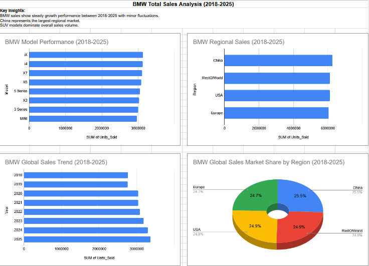

# BMW Global Sales Analysis (2018–2025)

## Overview
This project analyzes BMW global sales data to identify trends over time, evaluate regional performance, and understand which vehicle models contribute most to total sales.

## Objectives
- Analyze sales trends from 2018–2025
- Compare performance across regions
- Identify top-performing vehicle models

## Tools Used
- Google Sheets
- Pivot Tables
- Data Visualization

## Key Insights
- Sales trends show fluctuations across the analyzed period
- Certain regions contribute a larger share of total sales
- Specific vehicle models drive the majority of global volume

## Files
- `bmw-sales-analysis.xlsx` — dataset and dashboard
